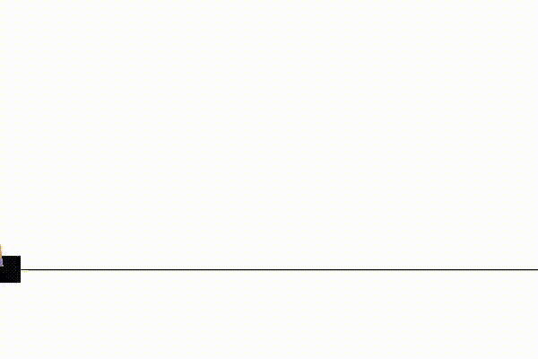
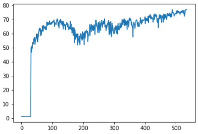
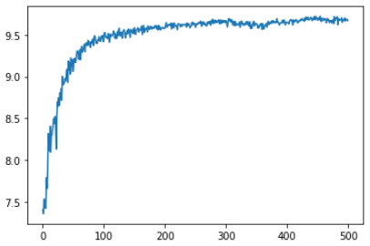
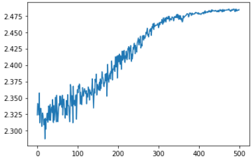
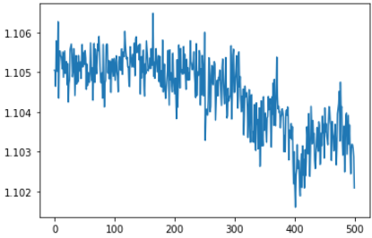
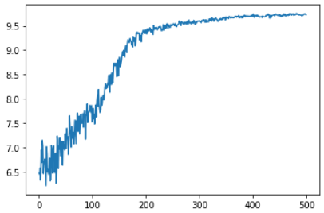
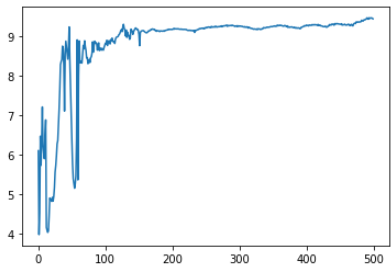
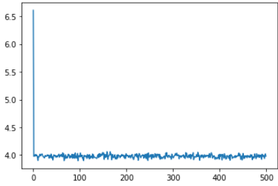

> Aprender a tomar buenas decisiones a base de prueba y error, utilizando recompensas como guía.
> 

Código: 



# ¿Qué es el aprendizaje por refuerzo?

El aprendizaje por refuerzo (Reinforcement Learning, RL) es un paradigma de aprendizaje automático en el que un agente aprende a tomar decisiones interactuando con un entorno. A diferencia del aprendizaje supervisado, aquí no hay etiquetas correctas. En su lugar, el agente recibe recompensas que le indican si lo está haciendo bien o mal.

El proceso se basa en un ciclo continuo:

1. El agente observa el estado del entorno
2. Elige una acción
3. El entorno responde con:
    - un nuevo estado
    - una recompensa
4. El agente aprende de esa experiencia

El objetivo es maximizar la recompensa acumulada a lo largo del tiempo.

Un ejemplo del uso de aprendizaje por refuerzo se puede ver en este vídeo: 

https://youtu.be/VMp6pq6_QjI?si=sb5rAhd0kl8K1Pii

## Conceptos clave

Estos son los elementos fundamentales:

- Estado (state, s)
Representa la situación actual del entorno.
- Acción (action, a)
Decisión que toma el agente.
- Recompensa (reward, r)
Señal numérica que indica cómo de buena ha sido la acción.
- Política (policy, π)
Estrategia que sigue el agente para elegir acciones.
- Retorno (return)
Suma de recompensas futuras (posiblemente descontadas).

## Problema formal: MDP

El aprendizaje por refuerzo se modela como un Proceso de Decisión de Markov (MDP), que incluye:

- Estados
- Acciones
- Transiciones entre estados
- Recompensas
- Factor de descuento (γ)

La propiedad de Markov es clave:

> El futuro depende solo del estado actual, no del pasado.
> 

## ¿Cómo aprende el agente?

Los algoritmos de RL buscan aprender una política óptima. Hay tres grandes enfoques:

### 1. Basados en valor

Aprenden cuánto vale cada estado o acción (ej: Q-learning)

### 2. Basados en política

Aprenden directamente la política (ej: REINFORCE)

### 3. Actor-Crítico

Combinan ambos enfoques:

- Actor → decide la acción
- Crítico → evalúa qué tan buena es

# Aplicación práctica: aprendizaje por refuerzo en CartPole

Una vez introducidos los conceptos básicos, el siguiente paso es aplicarlos a un problema concreto. En este proyecto he estudiado el comportamiento de un algoritmo de aprendizaje por refuerzo en un entorno clásico de control. El objetivo no es únicamente entrenar un modelo, sino analizar su comportamiento, entender cómo aprende y cómo afectan los distintos parámetros al resultado final.

Voy a utilizar el  entorno: CartPole (OpenAI Gym) y el algoritmo: Actor-Critic

## 2 Descripción del entorno: CartPole

El entorno CartPole es un problema clásico de control en el que el objetivo es mantener un poste en equilibrio sobre un carro móvil.

### Funcionamiento

Un poste está unido a un carro mediante una articulación. El carro se mueve horizontalmente sin fricción y el agente puede aplicar una fuerza hacia la izquierda o hacia la derecha. El objetivo es evitar que el poste caiga.

El episodio termina cuando ocurre alguna de las siguientes condiciones:

- El ángulo del poste supera los 12 grados respecto a la vertical
- El carro se desplaza más de 2.4 unidades desde el centro
- Se alcanzan 200 pasos (límite del entorno)

### Acciones

El espacio de acciones es discreto:

- 0 → mover el carro hacia la izquierda
- 1 → mover el carro hacia la derecha

Aunque las acciones son simples, la dinámica del sistema no lo es, ya que el movimiento depende del ángulo y la velocidad del poste.

### Estado

El estado del entorno está formado por 4 variables continuas:

- Posición del carro
- Velocidad del carro
- Ángulo del poste
- Velocidad angular del poste

### Recompensa

El sistema de recompensas es muy simple:

- Se obtiene +1 por cada paso en el que el poste permanece en equilibrio

Esto implica que el objetivo del agente es maximizar la duración del episodio.

### Criterio de éxito

Se considera que el problema está resuelto cuando:

- La recompensa media es ≥ 195 en 100 episodios consecutivos

## Intuición de la política óptima

De forma intuitiva, la política óptima consiste en:

- Mover el carro en la dirección necesaria para mantener el poste centrado y vertical
- Compensar continuamente tanto el ángulo como la velocidad angular

Es decir, el agente debe aprender un comportamiento de control dinámico, no una secuencia fija de acciones.

## Cómo aprende el algoritmo

En este caso se utiliza un enfoque Actor-Critic:

- El actor aprende una política que asigna probabilidades a cada acción dado un estado
- El crítico estima el valor del estado, es decir, la recompensa futura esperada

Durante el entrenamiento:

- El agente explora diferentes combinaciones de estados (posición, ángulo, velocidades)
- Aprende qué acciones permiten mantener el poste estable durante más tiempo
- Ajusta progresivamente su política para maximizar la recompensa acumulada

Este proceso permite que el agente pase de un comportamiento aleatorio a uno cada vez más estable.

## Modelo: arquitectura Actor-Critic

Para resolver el problema se ha implementado un modelo basado en el enfoque Actor-Critic utilizando redes neuronales con PyTorch.

La idea principal es aprender simultáneamente una **política** (actor), que decide qué acción tomar y una **función de valor** (crítico), que evalúa la calidad de los estados

## Primera aproximación

En una primera versión se utilizó una arquitectura sencilla con:

- una capa común compartida
- una capa lineal para el actor
- una capa lineal para el crítico

```python
class ActorCritic(nn.Module):
    def __init__(self, in_dim, out_actions_dim):
         super().__init__()
         #redes más commpleja

         self.common=nn.Linear(in_dim, 128) #o 128
         self.actor=nn.Linear(128, out_actions_dim) #definme actor, 4
         self.critic=nn.Linear(128,1)#critico

     def forward(self, state):
         x_common=self.common(state)
         probs=F.softmax(self.actor(x_common),dim=-1)#aplica softmax en la ultima dimension (-1)
         value=self.critic(x_common)

         return probs, value
```

Esta arquitectura permite que ambas partes del modelo compartan una representación del estado. Sin embargo, los resultados obtenidos mostraban un comportamiento inestable. Las recompensas medias fluctuaban considerablemente y el aprendizaje no era consistente. Esto sugiere que la capacidad del modelo era insuficiente para capturar correctamente la dinámica del entorno.

## Mejora de la arquitectura

Para mejorar el rendimiento, se modificó la red introduciendo más capas lineales y funciones de activación no lineales (ReLU).

La nueva arquitectura queda estructurada de la siguiente forma:

- Bloque común:
    - Linear → ReLU → Linear → ReLU
- Salida del actor:
    - Capa lineal + softmax
- Salida del crítico:
    - Capa lineal

```python
class ActorCritic(nn.Module):
    def __init__(self, in_dim, out_actions_dim):
        super().__init__()
        #redes más commpleja
        self.common=nn.Sequential(
            nn.Linear(in_dim,128),
            nn.ReLU(),
            nn.Linear(128,128),
            nn.ReLU(),
        )
        self.actor=nn.Linear(128, out_actions_dim) #definme actor, 4
        self.critic=nn.Linear(128,1)#critico

    def forward(self, state):
        x_common=self.common(state)
        probs=F.softmax(self.actor(x_common),dim=-1)#aplica softmax en la ultima dimension (-1)
        value=self.critic(x_common)

        return probs, value
```

Esta modificación permite aprender representaciones más complejas del estado y capturar relaciones no lineales entre las variables (posición, velocidad, ángulo, etc.).

## Salidas del modelo

El modelo devuelve dos elementos:

- **Probabilidades de acción (actor)**
Se aplica una función softmax para obtener una distribución de probabilidad sobre las acciones.
- **Valor del estado (crítico)**
Estimación escalar de la recompensa futura esperada desde ese estado.

## Selección de acciones

Durante la ejecución se muestrea una acción a partir de la distribución de probabilidades y se utiliza una distribución categórica para introducir exploración de forma natural. Esto evita que el agente se vuelva determinista demasiado pronto y permite seguir explorando durante el entrenamiento.

## Función de pérdida

El entrenamiento combina dos objetivos:

### Actor

El actor se entrena utilizando el gradiente de políticas, ponderado por la ventaja:

- si una acción ha sido mejor de lo esperado → se refuerza
- si ha sido peor → se penaliza

Esto se implementa utilizando el logaritmo de la probabilidad de la acción.

### Crítico

El crítico se entrena como un problema de regresión:

- intenta aproximar el retorno real obtenido

Se utiliza el error cuadrático entre valor estimado y retorno real.

### Pérdida total

La función de pérdida final es la suma de la pérdida del actor y la pérdida del crítico. Esto permite entrenar ambos componentes de forma conjunta.

## Intuición del aprendizaje

El proceso completo puede interpretarse de la siguiente forma:

- el agente prueba acciones en diferentes estados
- el crítico evalúa si esas decisiones han sido buenas o malas
- el actor ajusta su política en consecuencia

Con el tiempo el crítico mejora sus estimaciones y el actor toma decisiones cada vez más acertadas.

## Análisis de resultados

En esta sección se analiza cómo afectan distintos hiperparámetros al comportamiento del algoritmo, así como la evolución del aprendizaje a lo largo del entrenamiento.

## Evolución de las recompensas

Para evaluar el rendimiento del modelo, se ha utilizado la media de recompensas por batch durante el entrenamiento.

Esta métrica permite observar si el agente está aprendiendo, la estabilidad del entrenamiento y la velocidad de convergencia En general, para un comportamiento deseable debe haber un incremento progresivo de las recompensas y una estabilización en valores altos

## Influencia del factor de descuento

El factor de descuento (γ) controla la importancia de las recompensas futuras frente a las inmediatas.

- γ cercano a 0 → el agente prioriza recompensas inmediatas
- γ cercano a 1 → el agente tiene en cuenta el largo plazo

### Resultados obtenidos

### γ = 0.99

- Las recompensas aumentan rápidamente
- Se alcanzan valores altos
- Sin embargo, el entrenamiento es más inestable
- Tiempo de convergencia elevado (~1h 20min)

Interpretación:

El agente tiene una visión muy a largo plazo, lo que es adecuado para este problema, pero introduce más variabilidad en el aprendizaje.



### γ = 0.9

- Buen equilibrio entre rapidez y estabilidad
- Recompensas altas de forma consistente
- Menor tiempo de convergencia (~54 min)

Interpretación:

Este valor ofrece un compromiso adecuado entre corto y largo plazo, lo que facilita un aprendizaje más estable.



### γ = 0.6

- Rendimiento aceptable, pero inferior
- Aprendizaje más limitado
- Convergencia más rápida (~30 min)

Interpretación:

El agente empieza a perder información relevante del futuro, lo que afecta a la calidad de la política.



### γ = 0.1

- El modelo no aprende correctamente
- Las recompensas no mejoran
- Convergencia rápida pero a una solución pobre (~6 min)

Interpretación:

El agente solo tiene en cuenta recompensas inmediatas, lo cual no es suficiente en este problema, donde es necesario mantener equilibrio a lo largo del tiempo.



### Conclusión sobre γ

Para el entorno CartPole, es fundamental considerar recompensas a largo plazo. Valores altos de γ permiten aprender estrategias estables, aunque a costa de mayor tiempo de entrenamiento.

## 4.3 Influencia del learning rate

El learning rate controla la magnitud de las actualizaciones de los parámetros del modelo.

- valores bajos → aprendizaje lento pero estable
- valores altos → aprendizaje rápido pero inestable

### Resultados obtenidos

### lr = 0.01

- Buen rendimiento general
- Convergencia relativamente rápida (~54 min)
- Estabilidad adecuada

Interpretación:

Este valor proporciona un equilibrio correcto entre velocidad y estabilidad.


### lr = 0.001

- Aprendizaje más lento (~1h 5min)
- Recompensas iniciales más bajas
- Mayor estabilidad

Interpretación:

El modelo aprende de forma más progresiva, pero necesita más tiempo para alcanzar buenos resultados.



### lr = 0.1

- Mayor inestabilidad al inicio
- Fluctuaciones en las recompensas
- Convergencia más rápida (~41 min), pero menos consistente

Interpretación:

Las actualizaciones son demasiado grandes, lo que dificulta un aprendizaje fino.



### lr = 2

- El modelo no converge
- Comportamiento completamente inestable

Interpretación:

El valor es excesivamente alto, lo que impide que el modelo aprenda.



### Conclusión sobre el learning rate

Existe un compromiso claro entre velocidad y estabilidad. Valores intermedios permiten un aprendizaje eficiente sin comprometer la convergencia.

## Tiempo de convergencia

El tiempo de entrenamiento varía significativamente según los hiperparámetros:

- valores altos de γ → mayor tiempo
- learning rates bajos → mayor tiempo

Esto refleja el coste computacional de considerar el largo plazo y realizar actualizaciones más pequeñas.

## Evaluación cualitativa del modelo


Además del análisis cuantitativo, se ha evaluado el comportamiento del agente mediante la visualización de un episodio.

El modelo entrenado es capaz de mantener el poste en equilibrio durante unos segundos, manteniéndose cerca del centro inicialmente. Sin embargo, tras un cierto número de pasos, el sistema pierde estabilidad y el poste cae, normalmente hacia uno de los lados.

Este comportamiento indica que:

- el agente ha aprendido parcialmente la tarea
- es capaz de realizar correcciones iniciales
- pero no ha convergido a una política completamente óptima

En términos de recompensa, esto se traduce en episodios relativamente cortos, lejos del máximo teórico del entorno (200 pasos).

### Posibles mejoras

Para obtener un comportamiento más estable, se podrían considerar:

- aumentar el número de iteraciones de entrenamiento
- ajustar los hiperparámetros (learning rate, factor de descuento)
- reducir la exploración en fase de evaluación (por ejemplo, seleccionando la acción más probable)
- utilizar arquitecturas más complejas o técnicas más avanzadas

